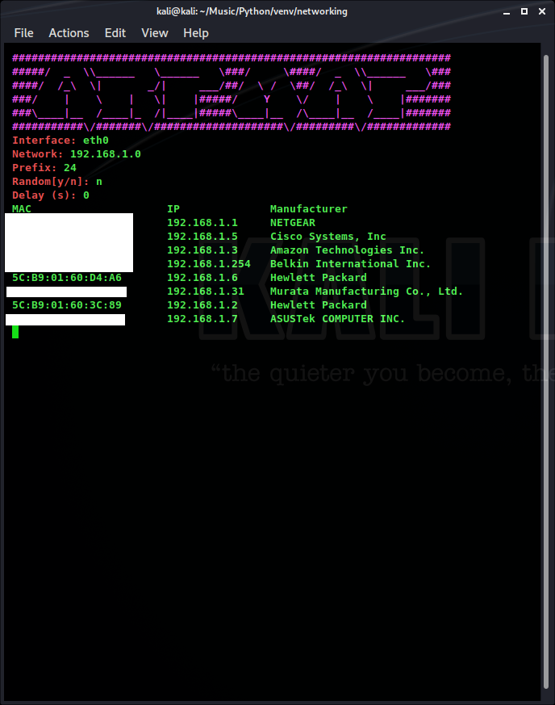

# sendit
Provides easy access to forming and sending custom Ethernet frame, ARP messages, IPv4 packets, and TCP/UDP Segments, as well as listening and responding to those protocols

## Getting Started

To Install use pip:
```
pip install sendit
```
Check out the docs:
[Read the Docs](https://sendit-docs.readthedocs.io/en/latest/)
### Sending data over TCP

The general structure is to first create a Raw_NIC - this is a wrapper class around a Python raw socket. 
Then from application layer (in this case just a string) to layer 2, create what you are going to send.
The order in which you create objects to send should be from the most encapsulated data to least -


```
nic = Raw_NIC("eth0")
payload = "The quick brown fox jumps over the lazy dog" #String payload
nic = Raw_NIC("eth0")   #Create Raw_NIC - replace interface name with your interface
# Creates TCP segment. IPs needed to calcualte checksum:
l4_tcp = TCP(50000, 50001, "192.168.1.1", "192.168.1.2", 1024, payload) # Change 1st ip to yours, 2nd to target.
# Creates IPv4 packet:
l3 = IPv4("192.168.1.1", "192.168.1.2", l4_tcp, protocol="tcp") # Change 1st ip to yours, 2nd to target
l2 = EtherFrame("AA:BB:CC:DD:EE:FF", "00:11:22:33:44:55", l3) # Change 1st mac to yours, 2nd to target
nic.send(l2) # Send payload - open up Wireshark to see your payload
 ```
 
In this example, l4_tcp, a TCP instance takes our string as payload. This is then put into l3, an IPv4 instance. l3 is then placed into l2, an EtherFrame instance. 
 
Every field and flag in these protocols can be changed, or left at their default values.


### Sending an ARP request
This works the similiar to sending data over TCP - we just replace an IPv4 instance with an ARP instance
Note how we have to change the EtherFrame type.

```
nic = Raw_NIC("eth0")
# Creates ARP request to find IP Change 1st MAC to your MAC, 1st IP to yours, 2nd IP to IP you are asking about
arp = ARP("AA:BB:CC:DD:EE:FF", "192.168.1.1", BROADCAST_MAC, "192.168.1.2")
l2 = EtherFrame("AA:BB:CC:DD:EE:FF", "00:11:22:33:44:55", arp, type="arp")
nic.send(l2)
```

### Creating a Responder to ARP Messages:
```
interface = "wlan0"
my_mac = get_MAC(interface)
mappings = {get_ip(interface): my_mac, "192.168.1.8": my_mac}

arp_listener = ARP_Listener(interface=interface, mappings=mappings, reply=True)

protocols = {my_mac: [arp_listener], BROADCAST_MAC: [arp_listener]}
listener = Ethernet_Listener(interface, protocols)
listener.listen()
```
This was adapted from applications/arp_daemon.py

First, we define the string name of the interface we want to listen on and respond to ARP messages on
In line 2, we grab the MAC on that NIC. 
In line 3 we create a dictionary mapping IP addresses to MACs to use to know what IPs to listen for and reply to with the ARP_Listener. Note that we are listening for our IP as well as 192.168.1.8, which may not be an IP for this device. The MACs we are using do not necessarily have to belong to this device either.
In line 5 we create out ARP_Listener. We set reply to true so that replies are sent out
In Line 7 we create a dictionary mapping MAC addresses to layer 3 protocol listeners. Here we set the arp_listener to get arp messages that have an Ethernet destination of my_mac or BROADCAST_MAC
In line 8 we create out Ethernet Listener, passing it the name of the interface to listen on and our mappings of higher layer listeners to MAC addresses
In line 9, we start the Ethernet Listener, which in turns starts the ARP_Listener, and now we are answering ARP replies for our IP and 192.168.1.8, matching it to my_mac

## Using ARPMap



This script leverages the power of networkingpy, sending out ARP requests across the entire subnet to map out what hosts are on the network. It is intended to be executed from the command line.

In directory arpmap.py is in, call
```
chmod +x ./arpmap.py
```
Then to use:
```
sudo ./menu.py
```
You will then be prompted for:

**Interface** - Name of interface to send ARP requests out of

**Network** - Network address of subnet you wish to map. Ex: 192.168.1.0

**Prefix** - Subnet mask prefix, values 8 - 32. Ex: 24

**Random** - 'y' or 'n', whether you want requests to be sent randomly or in order Ex: n

**Delay** - float value of delay between requests in seconds - to be used for slowing down network flood Ex: 0.01


Then it sends requests, and prints the MAC, IP, and Manufacturer of hosts that reply.

